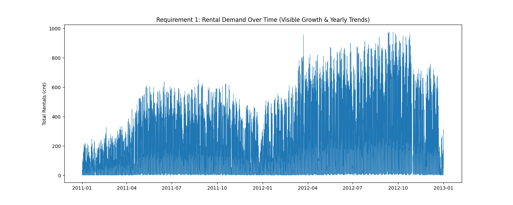
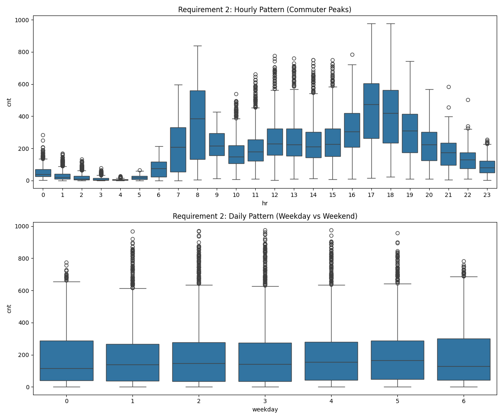
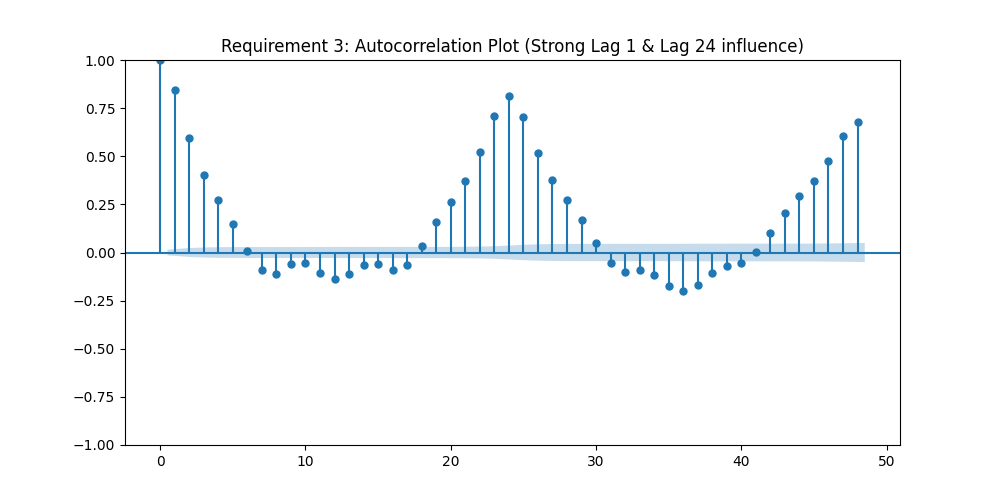
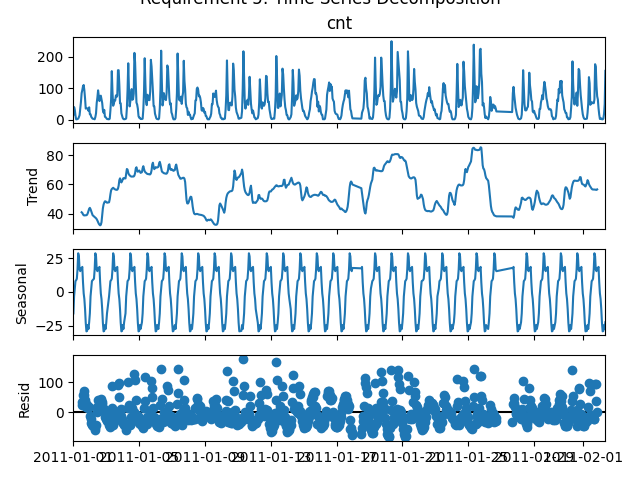
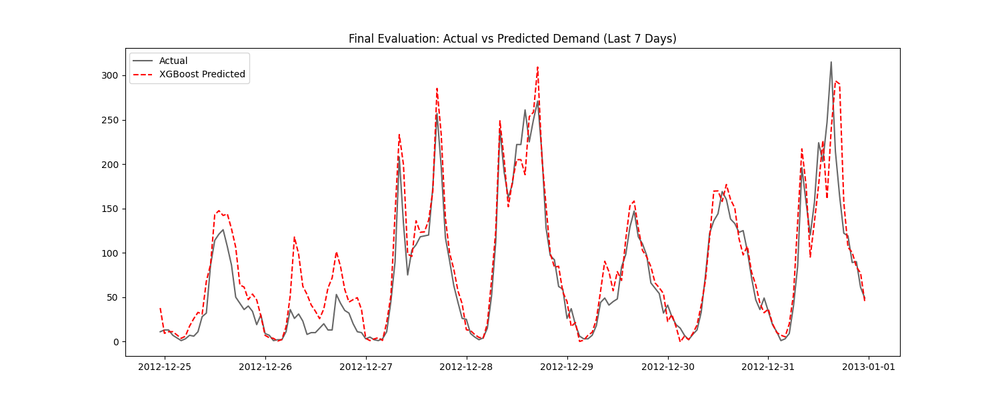

DATA PIPELINE DIAGRAM

A. Exploratory Data Analysis:
Temporal Rhythms: Our analysis identified a dual-mode behavior in demand. On weekdays, demand is driven by commuters, with massive spikes at 8:00 AM and 5:00 PM. On weekends, demand follows a smooth "bell curve" peaking in the early afternoon, driven by leisure activities.

The Growth Factor: By plotting demand over the full two years, a clear upward trend was visible. Demand in 2012 was significantly higher than in 2011, suggesting an expanding user base or increased station density.

Autocorrelation & Memory: The data showed extreme autocorrelation at Lag 1 (the previous hour) and Lag 24 (the same time yesterday). This confirms that bike sharing is not a series of random events but a continuous flow; if bikes are being rented now, they are very likely to be rented in the next 60 minutes.

Anomalies: Significant "dips" in the data were traced back to high-impact weather events (like Hurricane Sandy) and very low temperatures, where the physical environment temporarily overrides human routine.

B.Why XGBoost?
Unlike linear models, XGBoost is a Gradient Boosting algorithm. It builds trees sequentially, with each tree specifically learning to correct the errors made by the previous ones. This is ideal for bike demand because it can capture "step-changes"—for instance, the sudden jump in demand that happens exactly at 8:00 AM.

C.Feature Engineering
We didn't just give the model raw numbers; we gave it "intuition":

Lag 1 & 24: These act as the model's memory, allowing it to see both the immediate trend and the daily rhythm.

Weekend Flag: This acts as a logical switch, telling the model when to discard "Work Commute" logic in favor of "Leisure" logic.

## 📈 Visualization Results

### 1. Demand Over Time

### 2. Hourly & Daily Patterns

### 3. Autocorrelation

### 4. Time Series Decomposition

### 5. Actual vs Predicted (Validation)

